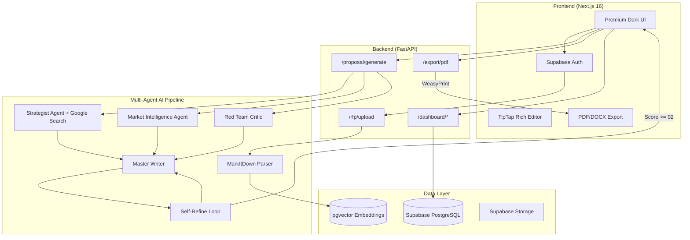

<div align="center">

# 🔥 BidForge

### The AI-Powered Enterprise Proposal Intelligence Platform

**Turn RFPs into winning proposals in minutes, not weeks.**

[](https://nextjs.org/)
[](https://fastapi.tiangolo.com/)
[](https://ai.google.dev/)
[](https://supabase.com/)
[](https://www.typescriptlang.org/)
[](https://python.org/)
[](LICENSE)

<br />

*Upload an RFP → AI reads, strategizes, and writes a boardroom-ready proposal with cover pages, compliance matrices, team org charts, and competitive intelligence — all in one click.*

</div>

---

## 📋 Table of Contents

- [Why BidForge](#-why-bidforge)
- [Key Features](#-key-features)
- [System Architecture](#-system-architecture)
- [Tech Stack](#-tech-stack)
- [Getting Started](#-getting-started)
- [Environment Variables](#-environment-variables)
- [Database Schema](#-database-schema)
- [API Reference](#-api-reference)
- [AI Pipeline Deep Dive](#-ai-pipeline-deep-dive)
- [Project Structure](#-project-structure)
- [Deployment](#-deployment)
- [Contributing](#-contributing)
- [License](#-license)

---

## 🎯 Why BidForge

Enterprise sales teams spend **40+ hours** manually writing each proposal. Most of that time is wasted on formatting, compliance mapping, and generic boilerplate. BidForge eliminates this entirely.

| Problem | BidForge Solution |
|---|---|
| Manual PDF parsing loses tables and structure | **MarkItDown** vision-based parser preserves every matrix and list |
| Generic, one-size-fits-all proposals | **Multi-Agent AI** with real-time Google Search grounding |
| No quality assurance before sending | **Self-Refine loop** (92/100 threshold) auto-corrects weak sections |
| Hours spent on compliance matrices | **Auto-generated Requirements Traceability Matrix (RTM)** |
| Ugly PDF exports | **WeasyPrint** backend engine with cover pages, headers, and footers |
| No competitive intelligence | **Market Intelligence Agent** ghosts competitors without naming them |

---

## ✨ Key Features

### 🤖 Multi-Agent AI Orchestration
Five specialized AI agents work in parallel to produce proposals that win:

| Agent | Role | Grounding |
|---|---|---|
| **Strategist** | Analyzes context, defines win themes and writing tone | Google Search |
| **Market Intelligence** | Finds competitor weaknesses, builds ghosting strategy | Google Search |
| **Red Team Critic** | Scores proposal gaps, outputs Win Probability (0–100) | Internal |
| **Quality Critic** | Evaluates draft on 7 criteria, triggers rewrites if score < 92 | Internal |
| **Master Writer** | Synthesizes everything into a send-ready proposal | All agents |

### 📄 SOTA Document Ingestion
- **MarkItDown** (Microsoft) vision-based PDF/DOCX/XLSX/PPTX parser
- Converts complex documents directly into structured Markdown
- Tables, headers, bullet lists, and matrices preserved perfectly
- Async processing — never blocks the event loop

### 🔄 Self-Refine Reflection Loop
Based on the *Self-Refine* research paper (Madaan et al., 2023):
1. Writer generates a full draft
2. Critic scores it on 7 quality dimensions
3. If score < 92/100, Writer rewrites only the weak sections
4. Loop runs up to 2 additional iterations
5. Only the polished, approved draft is streamed to the user

### 📊 Auto-Generated Visual Deliverables
Every proposal automatically includes:
- **Mermaid.js Architecture Diagram** (`graph TD`)
- **Mermaid.js Gantt Timeline** (Implementation phases)
- **Mermaid.js Project Team Org Chart**
- **Compliance Traceability Matrix** (top 5 requirements mapped)
- **Key Personnel Skills Matrix** table
- **Pricing & Investment** ROI table

### 🏢 Enterprise PDF Export
Backend-rendered via **WeasyPrint** with:
- Professional cover page (title, client, date, "Confidential")
- Native pagination with page numbers (Page X / Y)
- Headers ("CONFIDENTIAL") and footers ("Generated by BidForge")
- Plus Jakarta Sans typography
- Strict white background with dark text for printing
- Automatic client-side fallback to `html2pdf.js`

### 🔐 Enterprise Security
- **Supabase Auth** with JWT validation
- **Row-Level Security (RLS)** — complete multi-tenant org isolation
- **Prompt Injection Protection** — regex-based sanitization blocks jailbreak attempts
- **Rate Limiting** — 100 req/min per IP via SlowAPI
- **Auto-provisioning** — new users automatically get an org + admin profile

### 📈 Dashboard & Analytics
- Proposal history with status tracking (draft → review → sent → won/lost)
- Client management with industry tagging
- Win/loss analytics
- DOCX and PDF export for every proposal

### 🧠 RAG Knowledge Base
- Upload past proposals, case studies, and company context
- **Gemini Embedding 2** (768-dim) + **pgvector** for semantic search
- Background vectorization — upload response is instant
- Context automatically injected into every new proposal

---

## 🏗 System Architecture



---

## 🛠 Tech Stack

### Frontend
| Technology | Purpose |
|---|---|
| **Next.js 16** (App Router) | React framework with SSR/SSG |
| **React 19** | UI library |
| **TypeScript 5** | Type safety |
| **Tailwind CSS 4** | Utility-first styling |
| **Plus Jakarta Sans** | Premium typography (Google Fonts) |
| **GSAP 3.15** | Scroll animations and micro-interactions |
| **Lenis** | Smooth scrolling engine |
| **Framer Motion** | Layout animations |
| **TipTap** | Rich text editor for proposal editing |
| **Recharts** | Dashboard analytics charts |
| **Lucide React** | Icon system |
| **Sonner** | Toast notifications |
| **html2pdf.js** | Client-side PDF fallback |

### Backend
| Technology | Purpose |
|---|---|
| **FastAPI** | Async Python web framework |
| **Gemini 2.5 Flash** | Primary LLM (2M token context window) |
| **Google GenAI SDK** | Native tool-calling (Google Search) |
| **MarkItDown** | Vision-based PDF/DOCX parser (Microsoft) |
| **WeasyPrint** | Enterprise PDF rendering engine |
| **markdown2** | Markdown → HTML conversion |
| **Supabase** (PostgreSQL) | Database, Auth, Storage |
| **pgvector** | Vector similarity search for RAG |
| **SlowAPI** | Rate limiting middleware |
| **PostHog** | Product analytics and telemetry |
| **Sentry** | Error tracking and monitoring |
| **Stripe** | Billing and subscription management |
| **Resend** | Transactional email delivery |

---

## 🚀 Getting Started

### Prerequisites
- **Node.js** ≥ 18
- **Python** ≥ 3.11
- **pnpm** or **npm**
- **Supabase** project (free tier works)
- **Gemini API Key** ([Get one here](https://aistudio.google.com/apikey))
- **Homebrew** (macOS, for WeasyPrint dependencies)

### 1. Clone the Repository
```bash
git clone https://github.com/harshitnub077/BidForge.git
cd BidForge
```

### 2. Backend Setup
```bash
cd backend

# Create and activate virtual environment
python3 -m venv venv
source venv/bin/activate  # On Windows: venv\Scripts\activate

# Install Python dependencies
pip install -r requirements.txt

# Install system dependencies for WeasyPrint (macOS)
brew install pango gobject-introspection

# Configure environment
cp .env.example .env
# Edit .env with your API keys (see Environment Variables below)

# Start the backend
uvicorn main:app --reload
```
The backend will be running at `http://localhost:8000`.

### 3. Frontend Setup
```bash
cd frontend

# Install dependencies
npm install

# Start the dev server
npm run dev
```
The frontend will be running at `http://localhost:3000`.

### 4. Database Setup
1. Create a new project on [Supabase](https://supabase.com)
2. Navigate to the SQL Editor
3. Paste and run the contents of [`backend/supabase_schema.sql`](backend/supabase_schema.sql)
4. This creates all tables, RLS policies, storage buckets, and auto-provisioning triggers

---

## 🔑 Environment Variables

Create a `.env` file in the `backend/` directory:

```env
# Supabase (Required)
SUPABASE_URL=https://your-project.supabase.co
SUPABASE_KEY=your-anon-key
SUPABASE_JWT_SECRET=your-jwt-secret

# AI (Required)
AI_PROVIDER=gemini
GEMINI_API_KEY=your-gemini-api-key

# Optional Services
GROQ_API_KEY=              # Groq fallback
HF_API_KEY=                # HuggingFace fallback
RESEND_API_KEY=            # Email notifications
STRIPE_SECRET_KEY=         # Billing
POSTHOG_API_KEY=           # Product analytics
POSTHOG_HOST=https://app.posthog.com
SENTRY_DSN=                # Error tracking
```

Create a `.env.local` file in the `frontend/` directory:

```env
NEXT_PUBLIC_SUPABASE_URL=https://your-project.supabase.co
NEXT_PUBLIC_SUPABASE_ANON_KEY=your-anon-key
```

---

## 🗄 Database Schema

BidForge uses a multi-tenant PostgreSQL schema with **pgvector** for RAG and **Row-Level Security** for org isolation.

| Table | Purpose |
|---|---|
| `organizations` | Multi-tenant org containers with brand voice config |
| `profiles` | Maps Supabase Auth users → organizations (admin/member roles) |
| `documents` | Knowledge base with 768-dim vector embeddings (pgvector) |
| `proposals` | Generated proposals with status tracking (draft/review/sent/won/lost) |
| `rfp_questions` | Individual RFP Q&A with AI answers and confidence scores |
| `templates` | Reusable proposal templates with variables and industry tags |
| `usage_events` | Token usage and cost tracking for billing |

---

## 📡 API Reference

| Method | Endpoint | Description |
|---|---|---|
| `POST` | `/rfp/upload` | Upload an RFP document (PDF/DOCX/TXT) for AI parsing |
| `POST` | `/proposal/generate` | Generate a complete proposal (streamed response) |
| `POST` | `/export/pdf` | Render proposal markdown as enterprise PDF (WeasyPrint) |
| `GET` | `/dashboard/projects` | List all generated proposals for the authenticated user |
| `PUT` | `/dashboard/projects/{id}/status` | Update proposal status (draft/review/sent/won/lost) |
| `GET` | `/dashboard/clients` | List all clients |
| `POST` | `/dashboard/clients` | Create a new client |
| `GET` | `/dashboard/analytics` | Get win/loss analytics |
| `GET` | `/health` | Health check |

All endpoints (except `/health`) require a valid Supabase JWT token in the `Authorization: Bearer <token>` header.

---

## 🧬 AI Pipeline Deep Dive

The proposal generation pipeline is a 6-step orchestration that runs in ~30 seconds:

```
Step 1: Context Retrieval (pgvector RAG)
    ↓
Step 2: Parallel Agent Execution (asyncio.gather)
    ├── Strategist Agent (+ Google Search grounding)
    ├── Market Intelligence Agent (+ Google Search grounding)
    └── Red Team Critic Agent (Win Probability Score)
    ↓
Step 3: Master Writer generates full draft
    ↓
Step 4: Self-Refine Loop (max 2 iterations)
    ├── Quality Critic scores draft (7 criteria)
    ├── If score < 92 → Writer rewrites weak sections
    └── If score ≥ 92 → Draft approved ✅
    ↓
Step 5: Stream polished proposal to frontend
    ↓
Step 6: Save to Supabase (proposals table)
```

### Prompt Engineering Highlights
- **Anti-Gravity Rules**: 9 specific writing rules that make proposals win (mirror client language, quantify everything, name the risk they didn't mention)
- **Zero Placeholder Policy**: AI is strictly forbidden from using `[Your Name]`, `[Insert Date]`, or any bracketed placeholder
- **Tone Calibration**: Dynamically adjusts between formal government and energetic tech based on client profile
- **Competitor Ghosting**: Highlights strengths that exploit competitor weaknesses without naming them

---

## 📂 Project Structure

```
BidForge/
├── frontend/                    # Next.js 16 App Router
│   ├── src/
│   │   ├── app/
│   │   │   ├── page.tsx         # Main proposal generation UI
│   │   │   ├── layout.tsx       # Root layout (Plus Jakarta Sans)
│   │   │   └── globals.css      # Tailwind CSS 4 config
│   │   ├── components/
│   │   │   ├── Auth.tsx         # Supabase authentication
│   │   │   ├── DashboardLayout.tsx  # Sidebar + navigation
│   │   │   ├── TiptapEditor.tsx # Rich text proposal editor
│   │   │   ├── Logo.tsx         # BidForge logo component
│   │   │   └── layout/
│   │   │       ├── Cursor.tsx   # Custom GSAP cursor
│   │   │       └── Preloader.tsx # Boot animation
│   │   ├── lib/
│   │   │   ├── supabase.ts      # Supabase client
│   │   │   ├── doc_generation.ts # PDF/DOCX client-side export
│   │   │   └── utils.ts         # Utility functions
│   │   └── types/               # TypeScript type definitions
│   └── package.json
│
├── backend/                     # FastAPI Python Backend
│   ├── main.py                  # App entrypoint + CORS + rate limiting
│   ├── core/
│   │   ├── auth.py              # Supabase JWT verification
│   │   ├── config.py            # Pydantic settings (env vars)
│   │   └── telemetry.py         # PostHog + Sentry init
│   ├── routers/
│   │   ├── rfp.py               # RFP upload + MarkItDown parsing
│   │   ├── proposal.py          # Proposal generation (streaming)
│   │   ├── export.py            # WeasyPrint PDF rendering
│   │   ├── dashboard.py         # Projects, clients, analytics
│   │   └── billing.py           # Stripe integration
│   ├── services/
│   │   ├── main_pipeline.py     # Multi-Agent AI orchestration
│   │   ├── ai_layer.py          # Gemini SDK wrapper + embeddings
│   │   ├── pdf_renderer.py      # WeasyPrint PDF rendering service
│   │   ├── vector_db.py         # pgvector RAG service
│   │   └── billing.py           # Stripe billing service
│   ├── supabase_schema.sql      # Complete database schema
│   └── requirements.txt         # Python dependencies
│
└── README.md
```

---

## 🚢 Deployment

### Backend (Render / Railway / Fly.io)

```dockerfile
FROM python:3.11-slim

# WeasyPrint system dependencies
RUN apt-get update && apt-get install -y \
    libpango-1.0-0 libpangocairo-1.0-0 libgdk-pixbuf2.0-0 \
    libffi-dev libcairo2 && rm -rf /var/lib/apt/lists/*

WORKDIR /app
COPY requirements.txt .
RUN pip install --no-cache-dir -r requirements.txt

COPY . .
CMD ["uvicorn", "main:app", "--host", "0.0.0.0", "--port", "8000"]
```

### Frontend (Vercel)

```bash
cd frontend
vercel --prod
```

> **Note:** Update `ALLOWED_ORIGINS` in `backend/main.py` and all `localhost:8000` URLs in `frontend/src/app/page.tsx` to point to your production backend URL before deploying.

---

## 🤝 Contributing

1. Fork the repository
2. Create your feature branch (`git checkout -b feature/amazing-feature`)
3. Commit your changes (`git commit -m 'feat: Add amazing feature'`)
4. Push to the branch (`git push origin feature/amazing-feature`)
5. Open a Pull Request

---

## 📄 License

This project is licensed under the MIT License. See the [LICENSE](LICENSE) file for details.

---

<div align="center">

**Built with ❤️ by [Harshit](https://github.com/harshitnub077)**

*BidForge — Because winning proposals shouldn't take weeks.*

</div>
