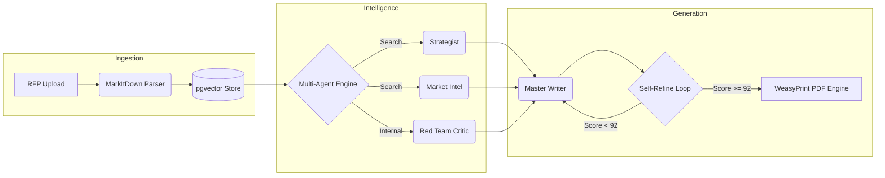
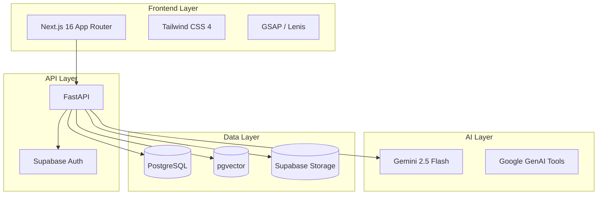

<div align="center">

# BidForge

**Enterprise Proposal Intelligence Platform**

*Automated RFP Analysis, Strategy, and Proposal Generation.*

<br/>

</div>

BidForge is a state-of-the-art AI orchestration platform designed for enterprise sales and bid teams. It ingests complex Request for Proposals (RFPs) and autonomously generates highly strategic, boardroom-ready proposals, completely eliminating the manual formatting and compliance mapping bottleneck.

## Core Architecture

BidForge operates on a multi-agent orchestration model, integrating real-time market intelligence, deterministic vector search, and a self-reflective generation loop.



## Platform Capabilities

- **Structure-Aware Ingestion**: Utilizes Microsoft's MarkItDown engine to extract perfect markdown from PDFs, preserving complex tables, matrices, and list hierarchies.
- **Autonomous Strategy Formation**: Employs real-time Google Search grounding to analyze the client's current business landscape and form highly contextual win themes.
- **Competitor Ghosting**: Dynamically retrieves common complaints about incumbent vendors in the client's industry and weaves subtle competitive positioning into the narrative.
- **Self-Refining Output**: Implements a strict evaluation loop. The Critic agent scores initial drafts against 7 distinct compliance and quality metrics. Sub-92 scores trigger automatic sectional rewrites.
- **Enterprise PDF Rendering**: Backend-rendered exports via WeasyPrint, featuring CMYK-ready styling, native pagination, headers/footers, and strict organizational branding.

## Technical Stack

The platform is designed for low latency, high concurrency, and complete data isolation.



### Dependencies
- **Frontend**: React 19, TypeScript 5, TipTap (Rich Text), html2pdf.js (Fallback Exporter).
- **Backend**: Python 3.11, FastAPI, Uvicorn, MarkItDown, WeasyPrint, Supabase SDK, SlowAPI.

## Deployment Instructions

### Prerequisites
- Node.js ≥ 18
- Python ≥ 3.11
- Homebrew (for WeasyPrint C-libraries on macOS)
- Supabase Project

### Environment Configuration

**Backend (`backend/.env`)**
```env
SUPABASE_URL=https://[YOUR_PROJECT].supabase.co
SUPABASE_KEY=[YOUR_SERVICE_KEY]
GEMINI_API_KEY=[YOUR_GEMINI_KEY]
```

**Frontend (`frontend/.env.local`)**
```env
NEXT_PUBLIC_SUPABASE_URL=https://[YOUR_PROJECT].supabase.co
NEXT_PUBLIC_SUPABASE_ANON_KEY=[YOUR_ANON_KEY]
```

### Local Execution

**1. Initialize Database**
Execute the contents of `backend/supabase_schema.sql` in your Supabase SQL Editor. This provisions all tables, Row-Level Security (RLS) policies, and vector extensions.

**2. Start API Service**
```bash
cd backend
python3 -m venv venv
source venv/bin/activate
pip install -r requirements.txt
brew install pango gobject-introspection # macOS PDF dependencies
uvicorn main:app --reload
```

**3. Start Web Client**
```bash
cd frontend
npm install
npm run dev
```

## Security & Compliance

- **Multi-Tenant Isolation**: Enforced strictly at the database level via PostgreSQL Row-Level Security (RLS).
- **Injection Protection**: Incoming RFP data is sanitized to neutralize prompt injection vectors prior to LLM evaluation.
- **Rate Limiting**: Configured at 100 requests per minute per origin IP via SlowAPI.

## License

This project is proprietary and confidential. All rights reserved.
